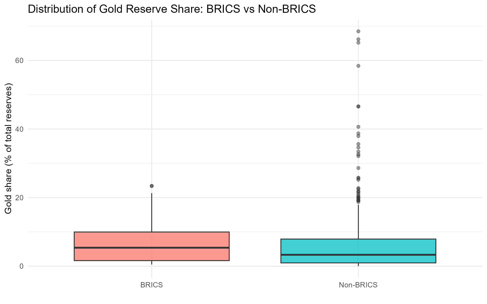
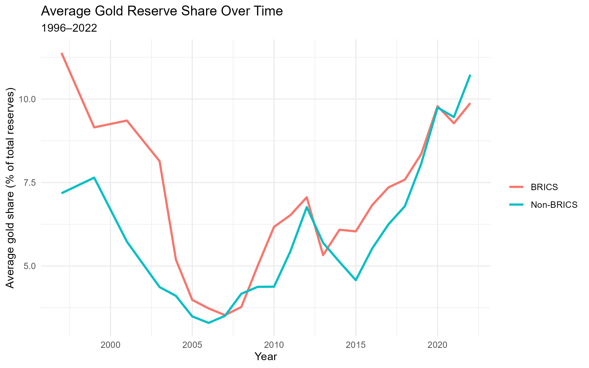
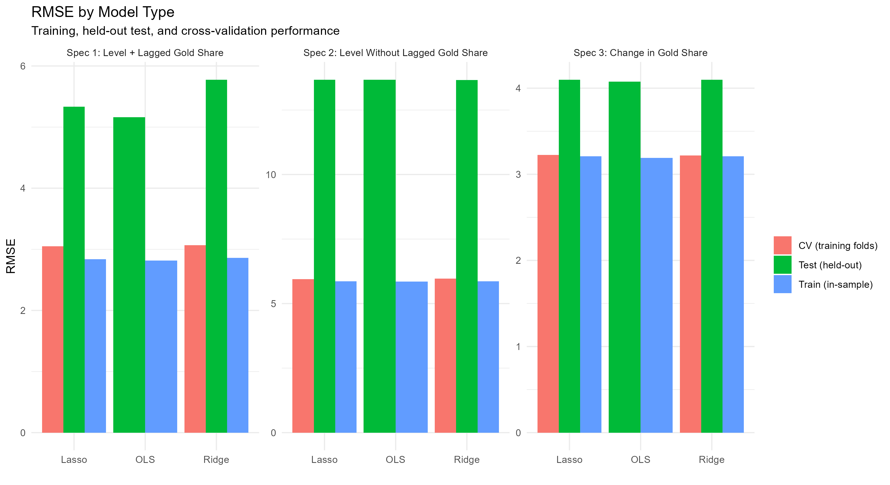
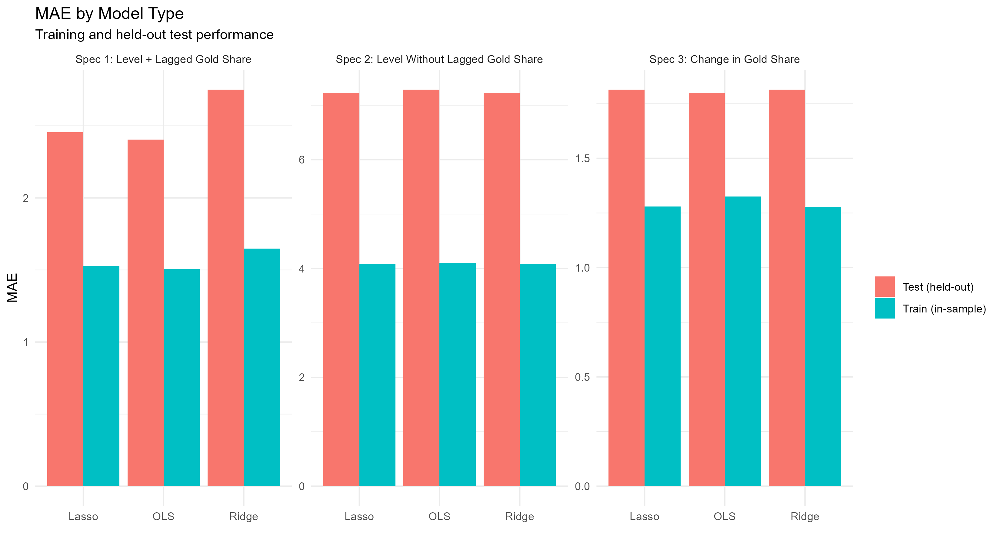

# Predicting Gold Reserve Diversification in BRICS and Emerging Markets

This project uses World Bank World Development Indicators data to examine whether gold reserve shares in BRICS and selected emerging-market economies can be predicted using lagged macroeconomic and institutional variables.

The analysis compares OLS, ridge regression, and lasso regression models across level and change specifications. The central question is whether reserve composition is primarily explained by persistence or whether lagged economic and institutional conditions help predict future diversification behavior.

## Project Overview

Central banks hold international reserves to support external stability, manage exchange-rate pressures, and protect against financial shocks. Although foreign currency assets make up the majority of most reserve portfolios, gold remains an important reserve asset because it is not directly tied to the liabilities of another sovereign issuer and may serve as a hedge against macroeconomic, geopolitical, and financial uncertainty.

This project studies gold reserve shares for BRICS and selected emerging-market economies from 1996 to 2022. Gold reserve share is constructed as the percentage of total reserves held in gold.

The project asks:

> Given lagged macroeconomic and institutional predictors, how well can we predict a country’s gold reserve share or changes in that share in a held-out future period?

## Data

The dataset is constructed from World Bank World Development Indicators data.

The sample includes the original BRICS countries and selected emerging-market economies across Latin America, Europe, the Middle East, Africa, and Asia.

Key variables include:

* Total reserves
* Total reserves excluding gold
* Constructed gold reserves
* Gold share of total reserves
* GDP per capita
* GDP per capita growth
* Inflation
* Trade as a share of GDP
* Manufacturing value added as a share of GDP
* Fuel exports as a share of merchandise exports
* Domestic credit to the private sector
* Political stability
* BRICS indicator

Raw WDI data is not included in this repository. To reproduce the analysis, place the WDI Excel export in:

```text
data/raw/P_Data_Extract_From_World_Development_Indicators.xlsx
```

## Methods

The project builds a country-year panel and constructs one-year lags of the predictor variables. The analysis uses a time-based train/test split:

* Training period: 1996–2018
* Test period: 2019–2022

Three model types are compared:

* OLS regression
* Ridge regression
* Lasso regression

Ridge and lasso models are tuned using cross-validation on the training data. Model performance is evaluated using:

* Root Mean Squared Error (RMSE)
* Mean Absolute Error (MAE)

## Model Specifications

The analysis compares three specifications:

### Spec 1: Level + Lagged Gold Share

Predicts current gold reserve share using prior-year gold reserve share, lagged macroeconomic and institutional predictors, and a BRICS dummy.

### Spec 2: Level Without Lagged Gold Share

Predicts current gold reserve share using only lagged macroeconomic and institutional predictors plus a BRICS dummy.

### Spec 3: Change in Gold Share

Predicts year-to-year changes in gold reserve share using lagged macroeconomic and institutional predictors plus a BRICS dummy.

## Key Findings

The results show that gold reserve composition is highly persistent. For level forecasts, the strongest benchmark is simply the prior year’s gold share. Adding lagged macroeconomic variables and a BRICS indicator does not meaningfully improve out-of-sample performance relative to that persistence baseline.

The change specification provides a more useful interpretation of the macroeconomic predictors. Although year-to-year changes in gold reserve share remain difficult to forecast precisely, lagged economic and institutional variables appear more informative for explaining adjustments in reserve composition than for predicting long-run reserve-share levels.

The similarity between OLS, ridge, and lasso performance suggests that the main limitation is not overfitting in a high-dimensional model, but rather the limited predictive signal available in the selected annual macroeconomic variables.

## Selected Figures

### Gold Reserve Share Distribution



### Average Gold Reserve Share Over Time



### RMSE Model Comparison



### MAE Model Comparison



## Repository Structure

```text
src/
  gold_reserve_modeling.R

docs/
  gold_reserve_diversification_paper.pdf

outputs/
  figures/
    gold_share_distribution_brics_vs_nonbrics.png
    average_gold_share_over_time.png
    rmse_model_comparison.png
    mae_model_comparison.png

  tables/
    group_summary.csv
    model_performance_comparison.csv
    baseline_metrics.csv
    ols_coefficients.csv
    ridge_coefficients.csv
    lasso_nonzero_coefficients.csv

data/
  raw/
    Raw WDI export should be placed here locally but is not included.

  processed/
    Cleaned modeling panel generated by the script.
```

## How to Run

1. Clone this repository.

2. Place the World Bank WDI Excel export in:

```text
data/raw/P_Data_Extract_From_World_Development_Indicators.xlsx
```

3. Open R or RStudio from the project root.

4. Run:

```r
source("src/gold_reserve_modeling.R")
```

The script will generate:

* Cleaned modeling data
* Model performance tables
* Baseline comparison tables
* Coefficient tables
* Figures for the README and paper

## Tools Used

* R
* readxl
* dplyr
* tidyr
* glmnet
* ggplot2
* OLS regression
* Ridge regression
* Lasso regression
* Time-based train/test evaluation
* Cross-validation

## Project Paper

A fuller written version of the project is available here:

```text
docs/gold_reserve_diversification_paper.pdf
```

## Author

Thomas Swide
